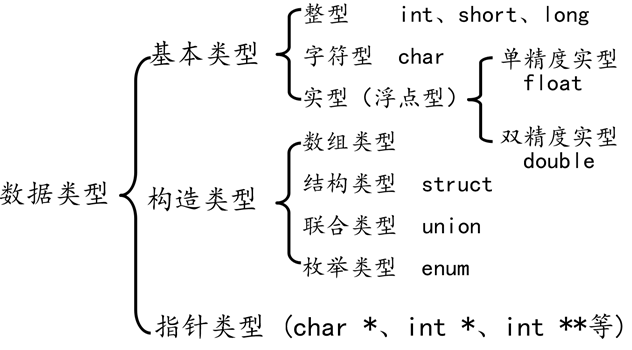
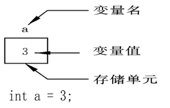

# 34个关键字

##### 关键字由系统定义，不可以重新作为其他的定义

| auto | break | case | char | const | continue | default | do |
| :--: | :--: |:--: | :--: | :--: | :--: | :--: | :--: |
| double | else | enum | extern | float | for | goto | if |
| int | long | register | return | short | signed | sizeof | static |
| struct | switch | typedef | unsigned | union | void | volatile | while |

# 限定符

| **限定符** | **含义**                                                     |
| ---------- | ------------------------------------------------------------ |
| extern     | 声明一个变量，extern声明的变量没有建立存储空间。 <br> extern int a; 声明一个变量，并不分配空间。只有后面定义的时候才分配 |
| const      | 定义一个常量，常量的值不能修改。  const int a = 10;          |
| Volatile   | 防止编译器优化代码<br>编译器会对一些代码进行优化，大部分情况下是好的。然而和硬件/驱动/内核相关的时候可能负优化 volatile int sum； 防止对该变量进行优化 |
| register   | 定义寄存器变量，提高效率。register是建议型的指令，而不是命令型的指令，如果CPU有空闲寄存器，那么register就生效，如果没有空闲寄存器，那么register无效。  有一些变量经常性的使用，如果空余，就定义在寄存器中 |

### 常变量

##### const 修饰的变量其值在变量存在期间不能被修改----

* ##### 并不是说没有方法修改， 定义指针也能修改值

* ##### 常变量在定义的时候==必须初始化==，可能会报错。有的时候不报错是因为系统自动赋值了

```C
int a;	//定义了一个变量，其类型为int，名字叫a
const int b = 10; //定义一个const常量，名为叫b，值为10
//b = 11; //err,常量的值不能改变
int *p = &a
*p = 15;// const 变量使用指针可以改变

const int b;
```

##### define定义了一个宏，其实就是定义了一个常量. ==没有分号==

```C
#define MAX 10
MAX = 100; //常量的值在程序运行中不能被更改
```

##### 两者区别

* ##### const 是常变量，具有数据类型，也有储存空间，只是其值不能被改变

* ##### define的是符号常量，预编译时候进行替换，不分配储存单元


## extern

##### extern 是声明而不是定义，也就是告诉编译器变量的存在，但是不为他分配任何的空间

```C
extern int a;
a = 10;	//err, 没有空间，就不可以赋值
```


# 声明，定义，初始化

##### 声明变量不需要建立存储空间，如：extern int a; 只声明没定义

##### 定义变量需要建立存储空间，如：int b; int b 既声明又定义

##### 初始化：在定义的时候进行赋值

# 数据类型

##### 作用：告诉编译器需要为对象（变量）分配的内存空间大小。告诉编译器数据在内存中需要多大的空间




C++和 java有bool 类型，C语言没有，完全是由整型来实现的

C/C++ int/short/long/long long/


浮点型的存储：IEEE754标准


##### 数据有两种形式：常量和变量

* ##### 常量：程序运行中值不可以被改变的量

* ##### 变量：程序运行中值可以被改变的量

### 常量：

##### 程序运行中值不可以被改变的量。常量的值不一定被初始化。但是常量定义过后，无论初始化与否，它的值都不能被改变了。

##### 常量可以被赋值给变量

##### 整型常量：100 200

##### 字符常量： ‘a’ 'b'  'c' '\0' '\n'  单引号引起来

##### 字符串常量: “a”,“ab”，“12356”  双引号引起来，并且末尾肯定有'\0'

##### 实型/浮点型  小数 + 指数    小数：3.14 -232.23  指数：12.34e3

##### 符号常量：#define PI 3.141561     

##### 实形中的指数形式/科学表示法：

* ##### E的大小无所谓，但是E==前后面==都必须有数，而且必须是==整数==

  * ##### 1e3   注意 .1e3 默认是0.1e3

  * ##### e表示10  $1e3=10^3 $

##### 字符常量：

* ##### C语言中字符的储存方式就是整数类型。


### 变量：



##### 程序运行中值不可以被改变的量

##### 变量必须==先定义====再使用==

##### 变量在使用前必须==先定义==，定义变量前必须有相应的数据类型

* ##### 定义：在内存中开辟空间 + 声明（告诉编译器变量的存在）

* ##### 定义形式： 数据类型 + 变量名

  * ##### int a; 定义了一个int类型的变量，它占据了4个字节

  * ##### int a = 15; 初始化 ==初始化：定义的时候赋值==

##### 变量名的规则：

* ##### 标识符不能是==关键字==，字母数字，下划线组成

* ##### 第一个字符必须是字母或者下划线，不能是数字

* ##### 区分大小写

* ##### java则还有$符号，必须以\$，下划线和字母开头，第一个字符都必须是字母或者下划线，都区分大小写

##### int char long short都是可以用来存整数的。char：最小整型单位

##### float: 精度为7位有效数字 double 15位有效数字


# C的进制

##### 1. C语言中==不可以书写二进制==，但是是可以书写十进制，八进制和十六进制

##### 2. C语言中书写八进制 0开头(0123 代表8进制)

##### 3. C语言书写十六进制 0x   0X开头(0-9   A-F)

* ##### 注意：在输出结果的时候，会自动把前缀删掉

* ##### 十六进制的X和后面的字母，大小写都是可以的，要输出大写就用%X,小写就用%x

##### 4. 如果你想把八进制和十六进制前缀弄出来, 在 X或者o前加#

~~~C
```C
int a = 123;//以十进制方式赋值
int b = 0123; //八进制方式赋值， 以数字0开头
int c = 0xABC; //十六进制方式赋值
//如果在printf中输出一个十进制数那么用%d，八进制用%o，十六进制是%x
prinf("%d",a); // 结果：123
printf("%o",b); //结果：123
printf("%x",c); //结果 abc
printf("%X",c); //结果 ABC

printf("%#o",b); //结果：0123
printf("%#X",c); //结果 0XABC
```
~~~

##### 4. 进制之间是可以相互打印转换的

##### 其实数据储存在内存中都是以补码的形式存在的, 储存形式是一样的,只是随着格式化打印方式不同, 输出形式发生了变化

```C
int a = 123;//以十进制方式赋值
prinf("%d",a);
printf("%o",a);
printf("%x",a);
```

## 原码, 反码, 补码

##### 注意, 无符号数, 所有位都表示数字,因此无符号位, 故==没有 原码, 反码, 补码==

##### 原码: 数的二进制表示

* ##### 最高位为符号位, 0 表示正数, 1 表示负数

* ##### 负数的原码: 最高位是 1, 其他位数不变的

* ##### 问题:

  * ##### 0的状态有两种

  * ##### 两个正数相减, 不同符号相加会出问题

##### 反码: 

* ##### 正数的反码和原码相同,

* ##### 负数符号位不变, 其他位取反, 1 变0 0 变 1

* ##### 计算结果正确, 但是还是有2 个 0 的状态

##### 补码

* ##### 正数 的反码  原码   补码 都是一样的

* ##### 负数的补码  等于反码 + 1

* ##### 计算结果正确, 0的状态只有一种

* ##### 已知补码, 符号位不动, 其他位求反, 然后整个加1, 得到原码

* $\color{red}{计算机中的数值一律采用补码来储存}$ 不管正数还是负数,


C语言在进行变量赋值时, 如果赋得是十进制, 给得是原码, 如果赋值给的是八进制或者十六进制,赋得是补码. 

打印时, 如果十进制打印, 要的是原码, 如果八进制或者是十六进制打印, 函数要的是数得补码 %x, %o

整数越位的例题:  

```C
char ch = 0x82;
printf("%d\n",ch); //-2
0x82 = 1000 0010(补码) 计算机中存储的就是1000 0010
printf要的是原码, 因此转化成原码 11111110 =-(2^7 -1 -1) =- 126
    
int num = 0x80000001;
printf("%d\n",num); // -2147483647
1. 先判断越位与否: 4* =32, 最高位不能是1, 肯定越位了
2. 十六进制, 储存的是补码  1000 000- 01
3. 十进制输出, 要的是原码, 转换 1111--1111, 32个1, 数据为 31位 于是等于 -(2^31-1)
    
char ch = -123
printf("%d\n",num); 
1. 不越位,因此输出 -123
    
int num = 0xffffffff
printf("%d\n",num);//-1
1. 越位 1111 1111-- 1111
2. 补码就是 1111   
3. 求原码, 100 --- 1   结果 -1

char num = 129;
printf("%d",num);  结果: -127
1. 越位 1000 0001   转换的时候不要犯错误:是正常转化为2进制,不是计算机中怎么储存的
2. 十进制赋值的是原码, 正数原码等于补码,于是储存的时候村的就是1000 0001
3. printf要的是原码, 但他发现1开头是负数,于是要转换成原码, 于是计算机中1111 1111 = -127
    
    
unsigned int num = 0xffffffff  不越界,打印正常, 因为无符号全是数据位
    

```


## 变量

char 1 字节

short 2字节

long win4字节    linux8字节

long long 8字节


### 有符号数和有符号 

##### 只有==整型==分有符号数和无符号数

* ##### 默认定义：有符号的

* ##### 有符号数：可以表示正数或者负数

* ##### 无符号数：只能表示正数

```C
signed int a = 123; //定义了有符号数
int a = 123; // 定义了有符号数
unsigned int a; // 定义了无符号数
```

##### 有符号数最高位为符号位,0代表正数,1代表负数

##### 如果是无符号,所有位数都是数据位,它只能表示正数

#### 有符号数和无符号数的表示范围

##### 注意,有符号数和无符号数能够表示数字的数目是相同的,只是范围不同

注意现实中的1111 1111 和计算机中的 1111 1111 是不一样的概念的

首先,以char为例.如果是有符号数, 正数范围 0 000 0000 ~ 0111 1111

111 1111 = 1000 0000 -1.注意转化为十进制中第八位是$2^7$,于是 正数范围为 $0~2^7-1$

负数范围为1 000 0000~ 1 111 1111 一样,但是注意,系统规定 1 000 0000 表示$-2^7$.于是char的范围为 $-2^7 \to (2^7-1)$

无符号数:$0-(2^8-1)$  第八位为$2^7$,第九位是$2^8$

|种类|占据空间|有符号|无符号|
|:-:|:-:|:-:|:-:|
|char|1B|$-2^7 \to (2^7-1)$|$0-(2^8-1)$|
|short|2B|$-2^{15}\to 2^{15}-1$|$0\to 2^{16}-1$|
|int|4B|$-2^{31}\to 2^{31}-1$|$0\to 2^{32}-1$|
|long|4B| $-2^{31}\to 2^{31}-1$ | $0\to 2^{32}-1$ |

例子

```C

```

因为十进制, 给的是原码, 原码 1000 0001. 计算机中他是负数,因为十进制存的是原码


# 


##### 打印格式:

| 打印格式 | 含义                        |
| -------- | --------------------------- |
| %d       | 输出一个有符号的10进制整型  |
| %o       | 输出一个有符号的八进制整型  |
| %x       | 输出一个16进制,字母小写输出 |
| %X       | 输出一个16进制,字母大写输出 |
|%u|输出一个10进制无符号数|

##### 整型输入

scanf() 从键盘(标准输入) 读取数据

```C
//不要加“\n”
scanf("%d", &a);

```


## sizeof

##### 1. sizeof不是函数, 它不需要包含任何头文件， 功能是计算一个数据的类型所占据空间大小， 单位为字节。

##### 2. sizeof的返回值为==size_t==， 它返回 unsigned int

```C
int a;
int b = sizeof(a);//sizeof得到指定值占用内存的大小，单位：字节
printf("b = %d\n", b);

size_t c = sizeof(a);
printf("c = %u\n", c);//用无符号数的方式输出c的值
```

```C
char a;
short b;
int c;
long d;
long long e;
int length = sizeof(a);
int length2 = sizeof(int);// 也是可以的

printf("%d\n",sizeof(a));
printf("%d\n",sizeof(b));
printf("%d\n",sizeof(c));
printf("%d\n",sizeof(d));
printf("%d\n",sizeof(e));
```

## 整型变量

| 类型           | 空间                             |
| -------------- | -------------------------------- |
| char(最小整形) | 1B                               |
| short(短整型)  | 2B                               |
| int(整型)      | 4B                               |
| long（长整型） | windows 4B Linux 32位 4B 64位 8B |
|long long(长长整形)|8B|

##### 注意， short 可以写成 short int， long 可以写成long int

##### 整型数据在内存中占的字节数与所选择的操作系统有关。虽然 C 语言标准中没有明确规定整型数据的长度，但 long 类型整数的长度不能短于 int 类型， short 类型整数的长度不能长于 int 类型

##### 当一个小的数据类型赋值给一个大的数据类型，不会出错，因为编译器会自动转化。但当一个大的类型赋值给一个小的数据类型，那么就可能==丢失高位==。

```
short a = 10;
```

##### 如果什么也不写默认int类型， 它经历了先把int转化为short， 然后赋值给short。

##### 先转换，再赋值=> ==隐式转换==


##### 整数类型

##### 如果什么符号不加，默认整型，加了就代表固定类型

| **整型常量** | **所需类型**               |
| ------------ | -------------------------- |
| 10           | 代表int类型                |
| 10l, 10L     | 代表long类型               |
| 10ll, 10LL   | 代表long long类型          |
| 10u, 10U     | 代表unsigned int类型       |
| 10ul, 10UL   | 代表unsigned long类型      |
| 10ull, 10ULL | 代表unsigned long long类型 |

| **打印格式** | **含义**                   |
| ------------ | -------------------------- |
| %hd          | 输出short类型              |
| %d           | 输出int类型                |
| %ld          | 输出long类型               |
| %lld         | 输出long long类型          |
| %hu          | 输出unsigned short类型     |
| %u           | 输出unsigned int类型       |
| %lu          | 输出unsigned long类型      |
| %llu         | 输出unsigned long long类型 |

```C
short a = 10;
int b = 10;
long c = 10l; //或者10L
long long d = 10ll; //或者10LL

printf("unsigned short a = %hu\n", a2);
printf("unsigned int b = %u\n", b2);
printf("unsigned long c = %lu\n", c2);
printf("unsigned long long d = %llu\n", d2);

```


### 字符型：char

##### char 既是字符型又是最小整型( char 的本质就是一个字节大小的整型)

* ##### char 类型既是可以存字符又是可以存数字的， 但本质上在内存中存的是数字

##### ASCII 码中有127个字符，char类型刚好能全部存储。

##### char 类型用于储存一个单一字符， 每个字符占据1B. 

* ##### 字符型变量本质存储的是该字符对应的ASCII码

* ##### 比如字符0 ASCII码：48  也就是说在内存中存的是48. 而数字0， 在内存中存的就是0

* ##### A： 65 a 97


注意'\0'和数字0是等价的，和字符'0'是不同的

##### 字符型变量赋值需要单引号括起来 'A'      '\n'

* ##### 注意==转义字符==都是有自己的ASCII码的， 算一个字符

```C
char ch = 'a';
printf("%d",ch); // 输出值97
char ch = '\n';
printf("%d",ch2); // 输出值10
```

* ##### 我们可以把单引号当成运算符，用来取它的ASCII码值， 然后进行赋值

```C
char ch = 'a';   char  ch = 97 其实是一样的
printf("%c\n", ch); //打印字符
printf("%d\n", ch); //打印字符对应的ASCII码值
```

##### 大写转小写，加32，小写转大写 -32   空字符ASCII码值为32，其实加减字符也可以得到

* ##### 字符的加减法本质上就是ASCII码值的加减法

##### 字符8转数字8, 减 48， 数字8转字符8 加48       48 就是 ‘0’

```C
char ch = 'a'; //97
printf("A = %c\n", ch - 32); //小写a转大写A
char ch2 = 'A'; //65
printf("a = %c\n", ch + 32); //大写A转小写a

printf("A = %c\n", ch - ' '); //小写a转大写A---里面有个空格
printf("A = %c\n", ch2 + ' '); //小写a转大写A---里面有个空格

//字符转数字
char ch ='8';
int a = ch -'0';
```

##### 一个特殊情况

```C
char ch = 'a';
printf("%d\n",sizeof(ch))//1
printf("%d\n",sizeof('a'))//4
```

* ##### char 类型是个变量，char类型占据一个字节

* ##### sizeof('a') 相当于sizeof(97) 常量97默认是int类型，int占据4B


### 从键盘上读取字符

```C
char ch;
scanf("%c",&ch); // 读取一个字符
```

做个小测试

```C
char ch;
char ch2;
scanf("%c",&ch);
scanf("%c",&ch2);
printf("ch=%c\n",ch);
printf("ch2=%c\n",ch2);
如果你输入的是 a c     那么输出值是 ch=a  ch2=, 其实空格被输入了
这种读取方式不能略去空格和回车。如果你只输入a然后回车， ch2 值为回车
    
只有输入时ac， 才正确读取两个字符。因为%c是一个字符一个字符读取的，理解以下
```


## 转义字符

有特殊含义的字符

实型变量也可以称为浮点型变量，浮点型变量是用来存储小数数值的。在C语言中， 浮点型变量分为两种： 单精度浮点数(float)4B、 双精度浮点数(double)8B， 但是double型变量所表示的浮点数比 float 型变量更精确。

由于浮点型变量是由有限的存储单元组成的，因此只能提供有限的有效数字。在有效位以外的数字将被舍去，这样可能会产生一些误差。

不以f结尾的常量是double类型，以f结尾的常量(如3.14f)是float类型。

```C
#include <stdio.h>

int main()
{
	//传统方式赋值
	float a = 3.14f; //或3.14F
	double b = 3.14;

	printf("a = %f\n", a);
	printf("b = %lf\n", b);

	//科学法赋值
	a = 3.2e3f; //3.2*1000 = 3200，e可以写E
	printf("a1 = %f\n", a);

	a = 100e-3f; //100*0.001 = 0.1
	printf("a2 = %f\n", a);

	a = 3.1415926f;
	printf("a3 = %f\n", a); //结果为3.141593

	return 0;
}

```

##### 打印时默认输出6位小数点

* float 类型只能保证7位精度(整数+小数)
* double 类型只能保证15位精度
* 输出几个小数点.nf

一般存小数可以用double存，因为精度更高

```C
float a = 3.1415926456;
double b = 3.1415926456;
printf("a=%.8f\n",a); //输出8位
printf("a=%.8lf\n",b); //输出8位
a=3.14159274
a=3.14159265
```


## 字符串常量

##### 1. 字符串常量是由==双引号==括起来的==字符序列==，如“china”、“C“

##### 2. 字符串在内存中是一段==连续的char空间==， 以'\0'结尾

* ##### 连续的char空间，相当于char数组

* ##### '\0' ASCII码为0。 它的作用就是标记，标记字符串的结束

* ##### 一般一个字符串字节数等于实际字符串加1，因为有\0。比如"abc"， 4个字节

```C
char[] str = "12312";
printf("%s",str);
```


printf


putchar: 输出一个char。要输出一个字符串只能用printf %s


## 格式输出

m.n格式：m宽度，n小数点个数

```
double a = 3.1415;
printf("%10.41f",a);

```


```C
int a =10;
prinf("%10d\n",a);   宽度为5位，不足的前面补空格
    prinf("%10-d\n",a);   宽度为5位，不足的前面补空格
    
    
    printf(%0-5d) 左对齐了补0没效果
```


## 练习

```C
char a = 'a';
printf("%d\n",sizeof(a));//1
printf("%d\n",sizeof('a'));//4 
printf("%d\n",sizeof("a"));//2
如果a， char类型，一个字节
sizeof'a' 字符型本质是ASCII码，相当于int 4B
字符串 一个字符还有末尾的'\0',因此2个字节

```

```C
printf("02d\n",12345); \\ 12345 数字本身就是5位，不可能占据2位，所以错误
```

```
int num1 = -10;
unsigned int num2 = 5;
printf("%u",num1+num2);
printf("%d",num1+num2);
num1 + num2 > 0?printf(">0\n"):printf("<0\n");
结果 4294967291      >0
要明确，unsigned int和int相加最后结果肯定是unsigned类型
num1 是 0000 0000 0000 0000 0000 0000 0000 1010
计算机中存它的补码 1111 1111 1111 1111 1111 1111 1111 0110
5无符号数 0000 0000 0000 0000 0000 0000 0000 0101
两个无符号数相加，结果为1111 1111 1111 1111 1111 1111 1111 1011
1. 最终的结果就应该是无符号的，因此肯定大于零
2. 这个无符号数是2^32-1-4= 4294967296-5 4294967291
3. 当然，你是可以把无符号转成有符号的，转成整型要的是原码，结果为负数，求原码
1000 0000 0000 0000 0000 0000 0000 0101   结果为-5


```


