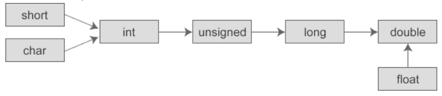

## 常用的运算符种类

| **运算符类型** | **作用**                               |
| -------------- | -------------------------------------- |
| 算术运算符     | 用于处理四则运算                       |
| 赋值运算符     | 用于将表达式的值赋给变量               |
| 比较运算符     | 用于表达式的比较，并返回一个真值或假值 |
| 逻辑运算符     | 用于根据表达式的值返回真值或假值       |
| 位运算符       | 用于处理数据的位运算                   |
| sizeof运算符   | 用于求字节数长度                       |

## 算数运算符

##### /： 除法，取整数  % 取余数

```C
int a = 10;
int b = 20;
int f = a / b; // 0   整型和整型的结果也是整型

double a = 10/3;   或者
int a1 = 10;
int a2 = 3;
double b = a1/a2; 结果都是一样的  3.000000
因为先计算int类型和int类型除法，然后转换成double
```

##### 整型和整型的运算结果也是整型

##### 两个数相除， 如果想得到小数部分，至少有一个数是double或者float类型

##### 除数不能为0， 否则会报错

```C
int a = 10;
int b = 20;
double f = a*1.0 / b; // 0.500000  或者 a/(b*1.0);
```

* 注意你可别写成a/b\*1.0   这样的画先计算a/b， 结果为0.000000了，写1/(b*1.0)行

##### C语言中除数不能为0，否则会报错 a/0

取余：

```c
int a=2;
int b=3;
int c = a%b; 
```

##### 求一个数的个十百千位

```c
a = 1234
int b = num/1%10 个位
int c = num/10%10 十位
int d = num/100%10 百位
int e = num/1000%10 千位

//取每个位的数
while(N!=0){
    print("%d\n",N%10);
    N=N/10;
}
//求二进制数, 求每个位数，储存在数组中，然后求逆
while(N!=0){
    r = N%2;
    N=N/2;
}
```

### 自增，自减

##### ++ 和--意义是一样的，以++为例：

* ##### 若单独的表达式  a++;     ++a; 都是相同的，表示a = a + 1;

* ##### ++ 在后，表示先执行其他，再自加   ++ 在前， 表示先自加，再使用

```C
int a = 1
int b = 0;
b=a++
printf("b=%d a=%d\n",b,a); //1 2

int a = 1
int b = 0;
b=++a
printf("b=%d a=%d\n",b,a); //2 2
```

* ##### printf也算一次使用，也符合++的规律

```C
c = 2;
printf("c=%d",c++);//2
c = 2;
printf("c=%d",++c);//3
```
#### arr的特殊情况
```
int arr[6];
arr[0]=0;
arr[1]=7;
arr[2]=4;
arr[3]=6;
arr[4]=8;
arr[5]=1;   // 0 1 2 3 4 5
int a = 1;
arr[a++]= arr[++a]+arr[a++];
for(int i=0;i<6;i++){
    printf("%d ",arr[i]);    // 0 1 2 4 4 5
} 
1. 整体分为三个部分，相当于(arr[a++])=(arr[++a])+(arr[a++])
2. 加号，从左向右结合，先算arr[++a]  a=2 arr[2]    然后 arr[2] a=3
3. 等号结合方向右到左：arr[a++]  arr[3] a = 4   arr[3] = 2arr[2] = 8
a = 4  0 7 8 6 8 1


a=1
arr[++a] = arr[a++]+arr[++a] + a // 0 7 4 6 17 1
1. 数组最大， 相当于加了括号 (arr[++a]) = (arr[a++])+(arr[++a]) + a
2. 于是顺序是 (arr[a++]) (arr[++a])  (arr[++a])   a
```

## 比较运算符

##### 比较运算符比较的结果一定是bool，真用数字1，假用数字0表示假

##### C语言中0为假，1为真，bool和0和1是一个概念

##### C语言中==非0为真==，0为假


##### A&&B AB表达式都为真，整个表达式才为真。如果A表达式为假，B表达式不执行

##### A||B 如果A前面为1，后面也不执行

```C
int a=5;
printf("%d\n",!a);0  因为C语言中非0就是假，0就是真
printf("%d\n",!0); 1
printf("%d\n",!-1); 0
    
int a = 0;
int b=1;

printf("%d\n",a&&b++);
prinf("a=%d, b=%d",a,b);
0
a=0, b=1
为什么第二个b为1，因为&&一假全假，如果第一个为0，第二个根本不执行，所以b的值不变，b++根本不执行
    
int a = 0;
int b=1;
printf("%d\n",b--&&a);
prinf("a=%d, b=%d",a,b);
0
0
a=0, b=0
--的优先级大于&&，先执行--然后&&

    
int a = 0;
int b=1;
printf("%d\n", b++|| a++);
printf("a=%d, b=%d", a, b);
a=0,b=2
如果A||B前面为1，后面也不执行
```

## 运算符优先级

##### 优先级从高到低 1-15级别

##### 不同优先级按照优先级顺序计算；相同优先级的多个运算符号，根据运算方向依次计算

* ##### 可以把优先级想象成加了一个括号, 然后按照括号的方向进行计算

* ##### 如果出现了如arr[a++]的形式，即使优先级括号先，也要先算里面才能算数组

```C
int a = 1;
int b = 2;
 int c = 0;
c+=a*=10; //10
相同优先级结合方向：右到左 a = a* 10   c = c+a  =10
    
int c = 10;
int b = 2;
printf("%d",c+++b);//12
++ 优先级高， 于是 c++ +b
虽然++优先级比b高，但是++特性，++在后，先使用  于是 c+b, 然后打印，最后加
    
```

##### 逗号运算符：值是最后一个表达式的结果

* ##### 从左到右依次把所有的结果都计算一遍，然后结果是最后一个表达式的结果

```C
int a = 1,

int b = 2.

int c = (a++,b++,10,200,a+b);

a = 2, b =3  c =5
```


## 数据的类型转换

##### 1. 数据有不同的类型，不同类型数据之间进行混合运算时必然涉及到类型的转换问题。

* ##### 转换过程中有可能会导致精度降低

##### 2. 转换的方式：

* ##### 隐式转换（自动转换）：遵循一定的规则，由编译系统自动完成

* ##### 强制类型转换：把表达式的运算结果强制转换成所需要的数据类型

##### 强制转换：（目标类型）原来的数据

##### 将一种类型的数据赋值给另外一种类型的变量时就会发生自动转换，例如：

```C
float f = 100;
float http = 3.15132
int n = http;
```

在不同类型的混合运算中，编译器也会自动地转换数据类型，将参与运算的所有数据先转换为同一种类型，然后再进行计算。转换的规则如下：

- 转换按数据长度增加的方向进行，以保证数值不失真，或者精度不降低。例如，int 和 long 参与运算时，先把 int 类型的数据转成 long 类型后再进行运算。
- 所有的浮点运算都是以双精度进行的，即使运算中只有 float 类型，也要先转换为 double 类型，才能进行运算。
- char 和 short 参与运算时，必须先转换成 int 类型



printf格式化不能进行转换, 在输出的时候一定要调整好类型

```C
int a = 3;
double b = a;  // 这一步发生了自动的类型转换，这一步叫做隐式转换
printf("%lf",b)//3.000000
    
printf("%d\n",3.14);//这时候不能直接转换---乱码
那么就需要强制的类型转换：当所需要的类型和要求的类型不匹配，就需要强制的类型匹配
printf("%d\n",(int)3.14)
    
printf("%lf\n",a)//类型不匹配，结果有误
printf("%lf\n",(double)a)  //需要强制转换
    
x = 3.6f;
int i = (int)x;

```

强制转换的宗旨：数据不可以丢失.为了保证不丢失 一般是小的转大的，大的转小的要考虑数据不丢失

一般所有的都转换，等号两端如果类型不匹配，尽量进行转换


```C
int num1 = -10
unsigned int num2 = 5
printf("%d",num1-num2);    
```

